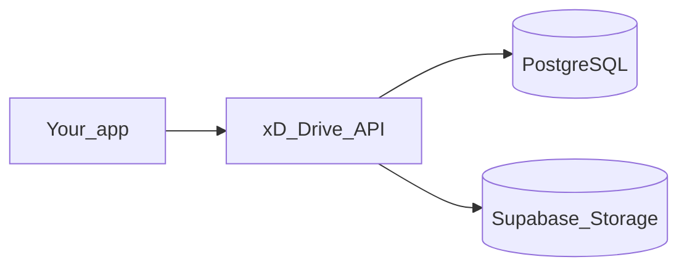

# xD-Drive

**xD-Drive** is a cloud storage backend—a drive-style API you can plug into a web or mobile client. Users sign up, organize files in nested folders, share content with others, and review what happened on their account.

**License:** [GPL-3.0-or-later](LICENSE)

---

## What it does

xD-Drive separates **metadata** (who owns what, folder structure, permissions, history) in PostgreSQL from **file content** in object storage. You get a full file-management service without building storage, auth, or audit trails from scratch.



Interactive API reference: **[http://localhost:3000/docs](http://localhost:3000/docs)** after you start the server (Scalar + OpenAPI).

---

## Features

### Accounts and security

- **Registration and login** with passwords hashed using **bcrypt**
- **JWT sessions** delivered as secure, httpOnly cookies (access + refresh tokens)
- **Email verification** for new accounts
- **Safe user profiles**—passwords never returned in API responses
- **Profile management**—view and update your account, or delete it

### Your drive

- **Nested folders and files**—create folders inside folders, upload files anywhere in the tree
- **Browse** your root drive or open a folder to see its contents
- **Upload and download** files with signed download links
- **Rename, move, delete, archive, and restore** items
- **Storage quotas** per user—uploads are blocked when you exceed your limit
- **Smart naming**—duplicate folder names are resolved automatically; uploads can deduplicate by content hash

### Sharing

- **Public links**—share a file or folder via a link, with optional expiry
- **Share with people**—grant access to another user by email
- **Permission levels**—viewer, commenter, or editor
- **See who has access**—list all shares on a resource

### Activity and operations

- **Activity log**—creates, uploads, downloads, renames, moves, deletes, archives, and restores are recorded automatically
- **Review history** for your account or for a specific file/folder
- **Health check** for monitoring uptime and database connectivity

### Coming soon (in schema, not yet in the API)

- Tags on files and folders
- File version history
- Favorites

---

## Tech stack

| Layer | Tools |
|-------|--------|
| Runtime | Bun |
| API | Hono, OpenAPI, Scalar docs |
| Database | PostgreSQL, Drizzle ORM |
| Validation | Zod (including schemas generated from the database) |
| Auth | JWT (httpOnly cookies), bcrypt |
| File storage | Supabase Storage |
| Logging | Pino |
| Quality | Biome |
| Deploy | Vercel |

---

## Getting started

### Prerequisites

- [Bun](https://bun.sh)
- PostgreSQL
- [Supabase](https://supabase.com) project with a Storage bucket named **`uploads`**

### Run locally

```sh
bun install
cp .env.example .env   # add your database and Supabase credentials
bun run dev
```

Open [http://localhost:3000/docs](http://localhost:3000/docs) to try the API.

Production:

```sh
bun run build
bun run start
```

### Environment

Copy [`.env.example`](.env.example) to `.env`. You need at minimum:

- `DATABASE_URL` — PostgreSQL
- `SUPABASE_URL` and `SUPABASE_ANON_KEY` — file storage

For production, set strong values for `JWT_SECRET`, `JWT_REFRESH_SECRET`, and `COOKIE_SECRET`, and use `APP_ENV=prod`.

### Database

```sh
bun run db          # migrations and Drizzle tooling
bun run db:seed     # sample data for development
```

### Deploy

Build the app (`bun run build`) and deploy to Vercel. The API is served under `/api`; see `.env.example` for all configuration options.

---

## Scripts

| Script | Description |
|--------|-------------|
| `dev` | Start dev server with hot reload |
| `start` | Run production build |
| `build` | Bundle for production |
| `check` | Lint and format with Biome |
| `db` | Drizzle Kit CLI |
| `db:seed` | Seed the database |

---

## Author

**Drish** — [drishxd.dev](https://drishxd.dev) · hey@drishxd.dev
